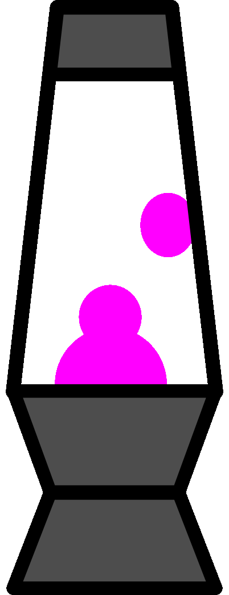

# Hi there! 

- I am Hallvard
- I am a bioinformatician and software developer at the University of Oslo.
- My research interests are focused on image analysis and epigenetic gene regulation.

 
 
- 
